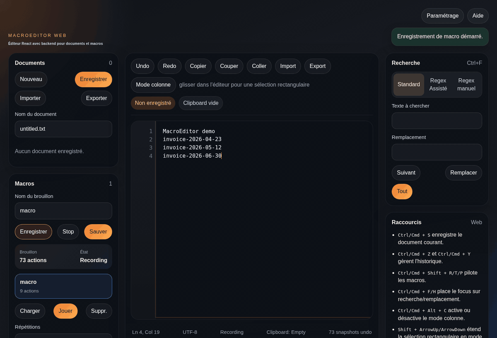

# MacroEditor

MacroEditor est un éditeur de texte orienté macros sémantiques.
Le dépôt contient aujourd'hui deux applications :

- une application desktop GTK4 en Python
- une application web avec frontend React et backend Express
- un packaging Windows basé sur la version web embarquée

L'objectif du projet est de permettre l'édition de texte, l'enregistrement de macros métier, leur persistance JSON et leur relecture avec un comportement prévisible.

## Démo Visuelle



Pour rendre la page GitHub plus parlante, le README gagne à embarquer une démo courte montrant :

- l'enregistrement d'une macro
- sa relecture sur plusieurs lignes
- le mode colonne
- la recherche avec assistant regex

Format recommandé :

- GIF court de 10 à 20 secondes pour le README
- vidéo MP4 un peu plus longue en asset de release pour une démo plus nette

Convention simple à utiliser dans le dépôt :

- `docs/media/macroeditor-demo.gif`
- `docs/media/macroeditor-demo.mp4`

Une fois le GIF créé, il peut être référencé directement ici dans le README avec une balise Markdown standard.

## Fonctionnalités

### Éditeur

- nouveau document, ouverture, sauvegarde et suppression
- copier, couper, coller, undo, redo
- numéros de ligne
- barre d'état avec ligne, colonne, état d'enregistrement et état du document
- import/export de fichiers locaux dans la version web

### Mode colonne

- activation/désactivation dédiée
- sélection rectangulaire à la souris
- extension verticale au clavier
- copier/couper/coller sur bloc
- restauration complète via undo/redo

### Macros

- enregistrement de macros sémantiques
- mémorisation du texte saisi et des suppressions
- mémorisation des déplacements du curseur
- mémorisation des clics de repositionnement de curseur à la souris
- lecture de macro avec répétitions
- stockage JSON des macros

### Recherche

- recherche standard
- remplacement simple et global
- assistant regex
- mode regex manuel avancé avec flags
- copie de la regex générée

### Interface web

- thème sombre ou clair
- aide intégrée décrivant les principales possibilités de MacroEditor
- backend pour les documents et les macros

## Structure

```text
macroeditor/
├── app.py
├── main.py
├── editor/
├── macros/
├── packaging/
│   ├── debian/
│   └── windows/
├── ui/
├── utils/
├── server/
└── web/
```

## Version Desktop GTK

### Pré-requis

- Python 3.11+
- PyGObject
- GTK 4
- GtkSourceView 5
- Linux

### Installation des dépendances

```bash
sudo apt-get update
sudo apt-get install -y python3-gi gir1.2-gtk-4.0 gir1.2-gtksource-5
```

### Lancement

```bash
python3 main.py
```

## Version Web React + Backend

### Pré-requis

- Node.js 20+
- npm 10+

### Installation

```bash
npm install
```

### Développement

Lancer le backend :

```bash
npm run start:server
```

Lancer le frontend dans un second terminal :

```bash
npm run dev:web
```

Ouvrir ensuite `http://localhost:5173`.

### Build frontend

```bash
npm run build:web
```

## Données de la version web

- les documents sont stockés dans `server/data/documents/`
- les macros sont stockées dans `server/data/macros/`

Ces répertoires servent aux données runtime et ne sont pas destinés à être versionnés, hors fichiers `.gitkeep`.

## Packaging

Le dépôt sépare maintenant explicitement les cibles de packaging :

- `packaging/debian/` pour l'application GTK Linux
- `packaging/windows/` pour l'application Windows basée sur la version web

### Debian

Le dépôt contient une structure Debian pour produire un paquet `.deb` de l'application desktop GTK.
Le paquet installe aussi un lanceur GNOME avec icône dans `/usr/share/applications/` et `/usr/share/icons/hicolor/`.
Le build de release Debian est aussi automatisé dans GitHub Actions et publié sur la même GitHub Release que les artefacts Windows.

### Génération du paquet

```bash
npm run package:debian -- 0.3.1
```

Le fichier généré est :

```text
dist/macroeditor_0.3.1_all.deb
```

### Intégration GNOME

Le paquet Debian installe :

- le lanceur `io.github.nouhailler.macroeditor.desktop`
- l'icône `macroeditor.svg`
- le binaire `macroeditor`

Le `postinst` rafraîchit automatiquement :

- la base des fichiers desktop
- le cache des icônes GTK

### Windows

Le packaging Windows s'appuie sur la version web compilée et l'embarque dans un wrapper Electron.
L'application Windows démarre le serveur Express localement, sert le frontend React compilé et stocke ses données dans le profil utilisateur Windows.

Installation des dépendances Windows de packaging :

```bash
npm install --prefix packaging/windows
```

Préparation du runtime embarqué :

```bash
npm run prepare:windows-runtime
```

Build du paquet Windows :

```bash
npm run package:windows
```

Les artefacts sont générés dans :

```text
dist/windows/
```

Note pratique :

- le build de release Windows est automatisé via GitHub Actions sur `windows-latest`
- un tag Git `vX.Y.Z` déclenche la création des artefacts Windows et Debian puis leur publication sur la même GitHub Release
- un lancement manuel du workflow permet aussi de produire des artefacts de validation sans publier de release
- le dossier d'installation ne sert pas de stockage des documents et macros
- les données runtime sont redirigées vers le répertoire utilisateur de l'application

## Raccourcis principaux

- `Ctrl/Cmd + S` : enregistrer
- `Ctrl/Cmd + Z` : undo
- `Ctrl/Cmd + Y` : redo
- `Ctrl/Cmd + F` : rechercher
- `Ctrl/Cmd + H` : remplacer
- `Ctrl/Cmd + Shift + R` : démarrer/arrêter l'enregistrement de macro
- `Ctrl/Cmd + Shift + P` : jouer la macro
- `Ctrl/Cmd + Alt + C` : activer/désactiver le mode colonne

## Release

Le tag recommandé pour cet état du projet est `v0.3.1`.
Il couvre la base GTK existante, l'ajout de la version web React/Express, l'intégration GNOME améliorée et la démo visuelle embarquée.

Pour une release plus convaincante, les assets recommandés sont :

- le paquet `.deb`
- un GIF court pour l'aperçu GitHub
- éventuellement une vidéo MP4 de démonstration
- un changelog synthétique des nouveautés

## Licence

MIT.
